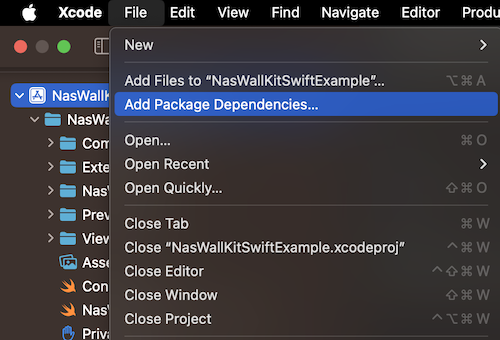
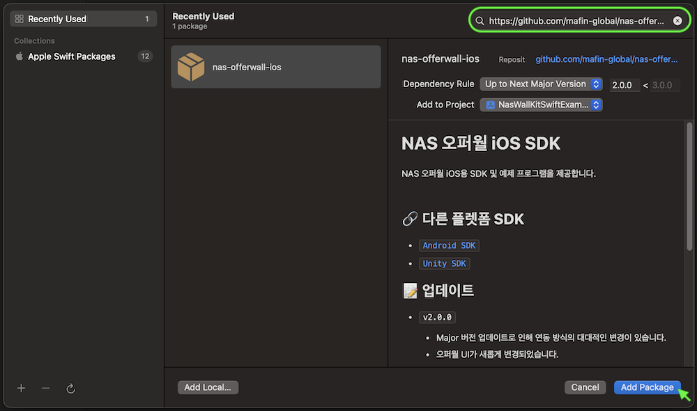
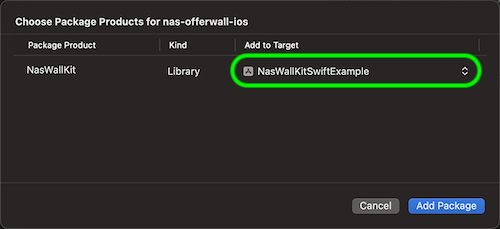
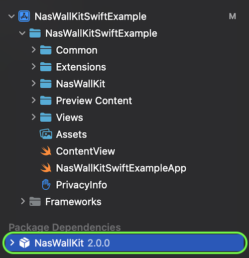
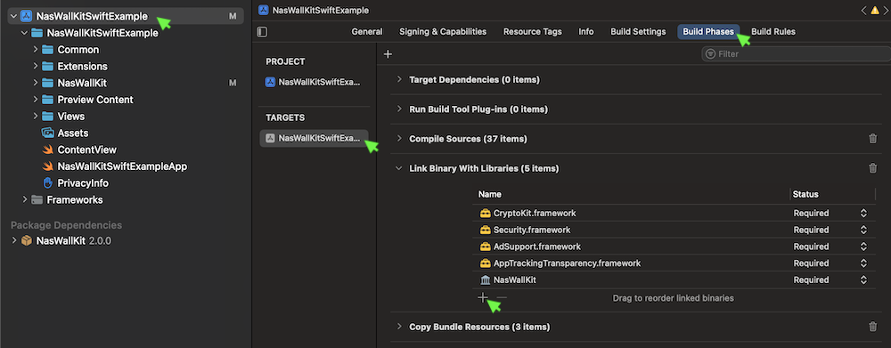
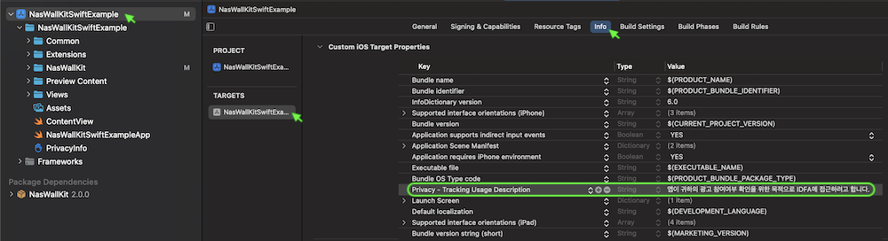

# 📖 NAS 오퍼월 iOS SDK - 개발자 정의 UI 개발 가이드
이 문서는 NAS 오퍼월 SDK 개발자 정의 UI 연동 가이드를 제공합니다.

오퍼월 UI 표시 방식은 다음 두가지를 지원합니다.

- `내장 UI` : 미리 만들어진 UI를 사용하는 방식으로, 별도의 UI 개발 없이 쉽게 연동할 수 있습니다.
- `개발자 정의 UI` : 개발자가 UI를 직접 만들어서 연동할 수 있는 방식으로, 개발자 앱의 UI에 맞게 자유롭게 구성할 수 있습니다.

`내장 UI`를 사용 하려면, [📖 내장 UI 개발 가이드](Guide.Embed.md) 문서를 참고해 주시기 랍니다.

## 목차
- [📝⠀업데이트](#-업데이트)
- [👤 개발자/매체 등록](#-개발자매체-등록)
- [💾 설치하기](#-설치하기)
  - [NasWallKit 추가](#-NasWallKit-추가)
  - [라이브러리 추가](#-라이브러리-추가)
  - [추적 권한 허용 표시 문구 설정](#-추적-권한-허용-표시-문구-설정)
  - [Privacy Manifest 설정](#-Privacy-Manifest-설정)
- [🚀 초기화](#-초기화)
  - [개발자 서버에서 적립금 관리 시](#-개발자-서버에서-적립금-관리-시)
  - [NAS 서버에서 적립금 관리 시](#-NAS-서버에서-적립금-관리-시)
- [📱 광고 표시](#-광고-표시)
  - [광고 목록 조회](#-광고-목록-조회)
  - [광고 상세 설명 조회](#-광고-상세-설명-조회)
  - [광고 참여](#-광고-참여)
  - [문의하기](#-문의하기)
- [💰 적립금](#-적립금)
  - [획득 가능 총 적립금 조회](#-획득-가능-총-적립금-조회)
  - [보유 적립금 조회](#-보유-적립금-조회-NAS-서버에서-적립금-관리-시-사용) *(NAS 서버에서 적립금 관리 시 사용)*
  - [아이템 목록 조회](#-아이템-목록-조회-NAS-서버에서-적립금-관리-시-사용) *(NAS 서버에서 적립금 관리 시 사용)*
  - [아이템 구입](#-아이템-구입-NAS-서버에서-적립금-관리-시-사용) *(NAS 서버에서 적립금 관리 시 사용)*
- [📦 기타](#-기타)
  - [테마 설정](#-테마-설정)
  - [Preview 전용 데이터 로드 지연 시간(초) 설정](#-Preview-전용-데이터-로드-지연-시간초-설정)
  - [Preview 전용 데이터 로드 강제 실패 처리 여부 설정](#-Preview-전용-데이터-로드-강제-실패-처리-여부-설정)
- [📘⠀정의](#-정의)
  - [NasWallAdListType](#-NasWallAdListType)
  - [NasWallAdList](#-NasWallAdList)
  - [NasWallAdInfo](#-NasWallAdInfo)
  - [NasWallPointInfo](#-NasWallPointInfo)
  - [NasWallItemList](#-NasWallItemList)
  - [NasWallItemInfo](#-NasWallItemInfo)
  - [NasWallTheme](#-NasWallTheme)
- [📖⠀다른 문서](#-다른-문서)
- [🔗⠀다른 플렛폼 SDK](#-다른-플렛폼-sdk)

## 📝 업데이트
- `v2.0.2`
  - 특정 상황에서 앱이 종료되는 오류가 수정되었습니다.

- `v2.0.1`
  - 특정 상황에서 광고 참여 완료가 정상적으로 되지 않는 오류가 수정되었습니다.

- `v2.0.0`
  - Major 버전 업데이트로 인해 연동 방식의 대대적인 변경이 있습니다.
  - 오퍼월 UI가 새롭게 변경되었습니다.
  - Swift 기반의 새로운 예제 프로그램이 제공됩니다.
  - 변경된 자세한 연동 방법은 개발 가이드 문서를 참고해주세요.


- [전체 업데이트 목록 보기](Update.md)

## 👤 개발자/매체 등록
[오퍼월 적용 가이드 문서](https://github.com/mafin-global/nas-offerwall#%EF%B8%8F-%EA%B0%9C%EB%B0%9C%EC%9E%90-%EB%93%B1%EB%A1%9D) 를 참고해주세요.

## 💾 설치하기

### 🔹 *NasWallKit 추가*
`File` > `Add Package Dependency...` 메뉴를 선택합니다.



우측 상단 검색에 `https://github.com/mafin-global/nas-offerwall-ios` 를 입력하고 `Add Package` 버튼을 클릭합니다.



`Add to Target` 이 개발 중인 프로젝트가 맞는지 확인하고 `Add Package` 버튼을 클릭합니다.



`NasWallKit` 패키지가 정상적으로 추가되었는지 확인합니다.



### 🔹 *라이브러리 추가*
`프로젝트 설정` > `Build Phases` > `Link Binary With Libraries` 에서 다음 라이브러리를 추가합니다.

- AppTrackingTransparency.framework
- AdSupport.framework
- CryptoKit.framework
- Security.framework



### 🔹 *추적 권한 허용 표시 문구 설정*

`Info.plist`에 `Privacy - Tracking Usage Description` 키를 추가한 후, 추적 권한 허용을 위한 표시 문구를 입력합니다. 문구는 앱의 성격에 맞게 변경할 수 있습니다.

- 추천 문구 : `앱이 귀하의 광고 참여여부 확인을 위한 목적으로 IDFA에 접근하려고 합니다.`



### 🔹 *Privacy Manifest 설정*

`/sdk` 폴더에 있는 `PrivacyInfo.xcprivacy` 파일에 SDK가 사용하는 Privacy Manifest 정보가 포함되어 있습니다.

귀사의 `PrivacyInfo.xcprivacy` 파일에 내용을 추가하거나, `/sdk` 폴더에 있는 파일을 사용하시기 바랍니다.

`Privacy Manifest` 관련 자세한 내용은 [애플 공식 문서](https://developer.apple.com/documentation/bundleresources/privacy_manifest_files)를 확인해 주시기를 바랍니다.

## 🚀 초기화
SDK를 초기화합니다.

*❗ SDK의 다른 모든 함수를 호출하기 전에 초기화 함수를 가장 먼저 호출해야합니다.*   
*❗ 앱 내에서 회원이 로그아웃 후 다른 계정으로 로그인하는 경우, 새로 로그인한 회원 정보를 기준으로 다시 초기화 함수를 호출해야합니다.*

### 🔹 *개발자 서버에서 적립금 관리 시*

```swift
func initialize(
    _ appKey: String,
    userData: String,
    testMode: Bool,
    handler: (@MainActor (_ error: NSError?) -> Void)? = nil
)
```

- `appKey`: 앱의 32자리 고유 키를 지정합니다. NAS 개발자 홈페이지의 "매체 관리" 메뉴에서 확인할 수 있습니다.
- `userData`: 회원 ID 등의 적립금 지급에 필요한 고유한 회원 정보를 지정합니다. 광고 참여 완료 시 개발자 서버로 콜백 호출될 때 함께 제공됩니다.
- `testMode`: `true` 로 설정 시 테스트 광고가 표시됩니다.
- `handler`: 초기화 처리 완료 시 호출되는 핸들러입니다.
  - `error`: 초기화 실패 시 오류 정보가 제공됩니다.

*사용 예시*
```swift
NasWall.initialize("32자리 앱 KEY", userData: "회원 데이터", testMode: false) { error in
    if error == nil {
       // 초기화 성공 시 처리 코드
    } else {
       // 초기화 실패 시 처리 코드
    }
}
```

### 🔹 *NAS 서버에서 적립금 관리 시*
```swift
func initialize(
    _ appKey: String,
    userId: String,
    testMode: Bool,
    handler: (@MainActor (_ error: NSError?) - Void)? = nil
)
```

- `appKey`: 앱의 32자리 고유 키를 지정합니다. NAS 개발자 홈페이지의 "매체 관리" 메뉴에서 확인할 수 있습니다.
- `userId`: 회원의 고유한 ID를 지정합니다. "적립금 조회", "아이템 구입" 시 여기서 지정한 회원 ID를 기준으로 적용됩니다.
- `testMode`: `true` 로 설정 시 테스트 광고가 표시됩니다.
- `handler`: 처리 완료 시 호출되는 핸들러입니다.
  - `error`: 초기화 실패 시 오류 정보가 제공됩니다.

*사용 예시*
```swift
NasWall.initialize("32자리 앱 KEY", userId: "회원 ID", testMode: false) { error in
    if error == nil {
        // 초기화 성공 시 처리 코드
    } else {
        // 초기화 실패 시 처리 코드
    }
}
```

## 📱 광고 표시

개발자 정의 UI로 광고를 표시하고, 광고에 참여하는 자세한 방법은 [예제 프로그램](/example)을 참고해주시기 바랍니다.

### 🔹 *광고 목록 조회*
광고 목록을 조회합니다.

*❗ Swift UI Preview 상태에서는 라이브 데이터가 아닌 Preview 전용 데이터가 조회됩니다.*

```swift
func adList(
    _ listType: NasWallAdListType,
    handler: @MainActor @escaping (_ adList: NasWallAdList?, _ error: NSError?) -> Void
)
```

- `listType`: 조회 할 광고 목록 구분을 지정합니다.
  - `.basic`: 참여적립 광고 목록 (CPI, CPE, CPA, CPC 등)
  - `.cps`: 쇼핑적립 광고 목록 (CPS)
  - `.cpq`: 퀴즈적립 광고 목록 (CPQ)
- `handler`: 처리 완료 시 호출되는 핸들러입니다.
  - `adList`: 조회 성공 시 광고 목록이 제공됩니다.
  - `error`: 조회 실패 시 오류 정보가 제공됩니다.

*사용 예시*
```swift
NasWall.adList(.basic) { adList, error in
    if error == nil {
        // 성공 시 처리 코드
    } else {
        // 실패 시 처리 코드
    }
}
```
### 🔹 *광고 상세 설명 조회*
광고 상세 설명을 조회합니다.

*❗ Swift UI Preview 상태에서는 라이브 데이터가 아닌 Preview 전용 데이터가 조회됩니다.*

```swift
func adDescription(
    _ adInfo: NasWallAdInfo,
    handler: @MainActor @escaping (_ description: String?, _ error: NSError?) -> Void
)
```

- `adInfo`: [광고 목록 조회](#-광고-목록-조회) 함수를 통해 획득한 광고 목록 중 조회할 광고 정보를 지정합니다.
- `handler`: 처리 완료 시 호출되는 핸들러입니다.
  - `description`: 조회 성공 시 광고 상세 정보가 제공됩니다.
  - `error`: 조회 실패 시 오류 정보가 제공됩니다.

*사용 예시*
```swift
NasWall.adDescription(adInfo) { description, error in
    if error == nil {
        // 성공 시 처리 코드
    } else {
        // 실패 시 처리 코드
    }
}
```

### 🔹 *광고 참여*
광고에 참여합니다.

*❗ Swift UI Preview 상태에서는 참여할 수 없습니다. 또한 시뮬레이터에서는 광고주 식별자(IDFA) 값이 없기 때문에 참여 시 오류가 발생합니다.*

```swift
func joinAd(
    _ adInfo: NasWallAdInfo,
    handler: @MainActor @escaping (_ error: NSError?) -> Void
)
```

- `adInfo`: [광고 목록 조회](#-광고-목록-조회) 함수를 통해 획득한 광고 목록 중 참여할 광고 정보를 지정합니다.
- `handler`: 처리 완료 시 호출되는 핸들러입니다.
  - `error`: 참여 실패 시 오류 정보가 제공됩니다.

```swift
NasWall.joinAd(adInfo) { error in
    if error == nil {
        // 성공 시 처리 코드
    } else {
        // 실패 시 처리 코드
    }
}
```

### 🔹 *문의하기*
문의하기(전체 화면)를 표시합니다.

```swift
func openCs(
    _ handler: @MainActor @escaping (_ error: NSError?) -> Void,
    closeHandler: (@MainActor () -> Void)? = nil
)
```

- `handler`: 처리 완료 시 호출되는 핸들러입니다.
  - `error`: 문의하기 열기 실패 시 오류 정보가 제공됩니다.
- `closeHandler`: 문의하기가 종료된 후 호출되는 핸들러입니다.

*사용 예시*
```swift
NasWall.openCs { error in
    if error == nil {
        // 성공 시 처리 코드
    } else {
        // 실패 시 처리 코드
    }
} closeHandler: {
    // 문의하기 종료 시 처리 코드
}
```

## 💰 적립금

### 🔹 *획득 가능 총 적립금 조회*
획득 가능한 총 적립금을 조회합니다.

*❗ Swift UI Preview 상태에서는 라이브 데이터가 아닌 Preview 전용 데이터가 조회됩니다.*

```swift
func totalPoint(
    _ handler: @MainActor @escaping (_ pointInfo: NasWallPointInfo?, _ error: NSError?) - Void
)
```

- `handler`: 처리 완료 시 호출되는 핸들러입니다.
  - `pointInfo`: 조회 성공 시 적립금 정보가 제공됩니다.
  - `error`: 조회 실패 시 오류 정보가 제공됩니다.

*사용 예시*
```swift
NasWall.totalPoint { pointInfo, error in
    if error == nil {
        // 성공 시 처리 코드
    } else {
        // 실패 시 처리 코드
    }
}
```

### 🔹 *보유 적립금 조회 (NAS 서버에서 적립금 관리 시 사용)*
NAS 서버에서 적립금을 관리하는 경우, 회원이 보유한 적립금을 조회합니다.

"적립금 관리 서버"가 "NAS 서버 사용"으로 설정된 경우에만 사용합니다.  "적립금 관리 서버" 설정은 NAS 개발자 홈페이지의 "매체 관리" 메뉴에서 설정을 통해 확인 및 변경할 수 있습니다.

*❗ Swift UI Preview 상태에서는 라이브 데이터가 아닌 Preview 전용 데이터가 조회됩니다.*   
*❗ [초기화](#-초기화) 함수를 통해 지정한 `userId(회원 ID)` 를 기준으로 조회됩니다.*

```swift
func userPoint(
    _ handler: @MainActor @escaping (_ pointInfo: NasWallPointInfo?, _ error: NSError?) - Void
)
```
- `handler`: 처리 완료 시 호출되는 핸들러입니다.
  - `pointInfo`: 조회 성공 시 적립금 정보가 제공됩니다.
  - `error`: 조회 실패 시 오류 정보가 제공됩니다.

*사용 예시*
```swift
NasWall.userPoint { pointInfo, error in
    if error == nil {
        // 성공 시 처리 코드
    } else {
        // 실패 시 처리 코드
    }
}
```

### 🔹 *아이템 목록 조회 (NAS 서버에서 적립금 관리 시 사용)*
NAS 서버에서 적립금을 관리하는 경우, 구입 가능한 아이템 목록을 조회합니다.

"적립금 관리 서버"가 "NAS 서버 사용"으로 설정된 경우에만 사용합니다.  "적립금 관리 서버" 설정은 NAS 개발자 홈페이지의 "매체 관리" 메뉴에서 설정을 통해 확인 및 변경할 수 있습니다.

*❗ Swift UI Preview 상태에서는 라이브 데이터가 아닌 Preview 전용 데이터가 조회됩니다.*

```swift
func itemList(
    _ handler: @MainActor @escaping (_ itemList: NasWallItemList?, _ error: NSError?) -> Void
)
```

- `handler`: 처리 완료 시 호출되는 핸들러입니다.
  - `itemList`: 조회 성공 시 아이템 목록이 제공됩니다.
  - `error`: 조회 실패 시 오류 정보가 제공됩니다.

*사용 예시*
```swift
NasWall.itemList { itemList, error in
    if error == nil {
        // 성공 시 처리 코드
    } else {
        // 실패 시 처리 코드
    }
}
```

### 🔹 *아이템 구입 (NAS 서버에서 적립금 관리 시 사용)*
NAS 서버에서 적립금을 관리하는 경우, 보유 적립금을 이용하여 아이템을 구입합니다.

"적립금 관리 서버"가 "NAS 서버 사용"으로 설정된 경우에만 사용합니다.  "적립금 관리 서버" 설정은 NAS 개발자 홈페이지의 "매체 관리" 메뉴에서 설정을 통해 확인 및 변경할 수 있습니다.

*❗ [초기화](#-초기화) 함수를 통해 지정한 `userId(회원 ID)` 를 기준으로 구입됩니다.*

```swift
func purchaseItem(
    _ itemId: Int,
    qty: Int,
    handler: @MainActor @escaping (_ pointInfo: NasWallPointInfo?, _ error: NSError?) -> Void
)
```
- `itemId`: 구입 할 아이템 ID를 지정합니다. NAS 개발자 홈페이지의 "매체 관리" 메뉴에서 아이템을 등록하면, 아이템 ID를 확인할 수 있습니다.
- `qty`: 구입 수량을 지정합니다.
- `handler`: 처리 완료 시 호출되는 핸들러입니다.
  - `pointInfo`: 구입 성공 시 구입 금액을 차감한 잔여 적립금 정보가 제공됩니다.
  - `error`: 구입 실패 시 오류 정보가 제공됩니다.

*사용 예시*
```swift
NasWall.purchaseItem(itemId, qty: 1) { pointInfo, error in
    if error == nil {
        // 성공 시 실행 코드
    } else {
        // 실패 시 실행 코드
    }
}
```

## 📦 기타

### 🔹 *테마 설정*
테마(라이트/다크 모드)를 설정합니다. 팝업, 임베드 오퍼월 표시될 때, 설정한 테마를 기준으로 배경색이 표시됩니다.

```swift
func theme(_ theme: NasWallTheme)
```

- `theme`: 테마를 지정합니다.
  - `.light`: 라이트 테마
  - `.dark`: 다크 테마

*사용 예시*
```swift
// 라이트 테마
NasWall.theme(.light)

// 다크 테마
NasWall.theme(.dark)
```

### 🔹 *Preview 전용 데이터 로드 지연 시간(초) 설정*
Swift UI Preview 모드에서 Preview 전용 데이터 로드 시 지연 시간(초)을 설정합니다.   
Preview 상태에서 데이터 로드 시 로딩 화면 표시를 확인하기 위해 사용합니다.

```swift
func debugPreviewDataDelaySeconds(_ seconds: Double)
```

- `seconds`: 지연 시간(초)을 지정합니다.

*사용 예시*
 ```swift
 NasWall.debugPreviewDataDelaySeconds(1)
 ```

### 🔹 *Preview 전용 데이터 로드 강제 실패 처리 여부 설정*
Swift UI Preview 모드에서 Preview 전용 데이터 로드 시 강제로 실패 처리할지 여부를 설정합니다.   
Preview 상태에서 데이터 로드 실패 시의 화면 표시를 확인하기 위해 사용합니다.

```swift
func debugPreviewDataForceFail(_ forceFail: Bool)
```

- `forceFail`: 강제 실패 여부를 지정합니다.

*사용 예시*
 ```swift
 NasWall.debugPreviewDataForceFail(true)
 ```

## 📘 정의

### 🔹 *NasWallAdListType*
광고 목록 구분
```swift
enum NasWallAdListType: Int {
    case basic = 0  // 참여적립 (CPI, CPE, CPA, CPC 등)
    case cps = 1    // 쇼핑적립 (CPS)
    case cpq = 2    // 퀴즈적립 (CPQ)
}
```

### 🔹 *NasWallAdList*
광고 목록
```swift
typealias NasWallAdList = [NasWallAdInfo]
```

### 🔹 *NasWallAdInfo*
광고 정보
```swift
class NasWallAdInfo {
    public let id: Int                          // ID
    public let title: String                    // 광고명
    public let missionText: String              // 미션
    public let iconUrl: String                  // 아이콘 URL
    public let adPrice: String                  // 참여 비용
    public let rewardPrice: Int                 // 적립금
    public let rewardUnit: String               // 적립금 단위
    public let category: NasWallAdCategory      // 카테고리
}
```

### 🔹 *NasWallPointInfo*
적립금 정보
```swift
class NasWallPointInfo {
    let point: Int           // 적립금
    let unit: String         // 적립금 단위
    let stringValue: String  // "(적립금)(단위)" 예)"35,270원"
}
```

### 🔹 *NasWallItemList*
아이템 목록
```swift
typealias NasWallItemList = [NasWallItemInfo]
```

### 🔹 *NasWallItemInfo*
아이템 정보
```swift
class NasWallItemInfo {
    let id: Int       // 아이템 ID
    let name: String  // 아이템 이름
    let price: Int    // 아이템 가격
    let unit: String  // 가격 단위
}
```

### 🔹 *NasWallTheme*
테마
```swift
enum NasWallTheme: Int {
    case light = 0  // 라이트 테마
    case dark = 1   // 다크 테마
}
```

## 📖 다른 문서
- [내장 UI 개발 가이드](Guide.Embed.md) : 미리 만들어진 UI를 사용하는 방식으로, 별도의 UI 개발 없이 쉽게 연동할 수 있습니다.

## 🔗 다른 플렛폼 SDK
- [Android SDK](https://github.com/mafin-global/nas-offerwall-android)
- [React Native SDK](https://github.com/mafin-global/nas-offerwall-react-native)
- [Unity SDK](https://github.com/mafin-global/nas-offerwall-unity)
