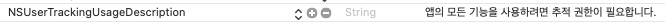

# 📖 NAS 오퍼월 iOS SDK - 개발자 정의 UI 개발 가이드
이 문서는 NAS 오퍼월 SDK 개발자 정의 UI 연동 가이드를 제공합니다.

오퍼월 UI 표시 방식은 다음 두가지를 지원합니다.

- `내장 UI` : 미리 만들어진 UI를 사용하는 방식으로, 별도의 UI 개발 없이 쉽게 연동할 수 있습니다.
- `개발자 정의 UI` : 개발자가 UI를 직접 만들어서 연동할 수 있는 방식으로, 개발자 앱의 UI에 맞게 자유롭게 구성할 수 있습니다.

`내장 UI`를 사용 하려면, [📖 내장 UI 개발 가이드](Guide.Embed.md) 문서를 참고해 주시기 랍니다.

## 목차
- [📝⠀업데이트](#-업데이트)
- [❗⠀주의사항](#-주의사항)
- [👤️⠀개발자/매체 등록](#%EF%B8%8F-개발자-매체-등록)
- [🚀⠀SDK 연동](#-sdk-연동)
    - [라이브러리 추가](#라이브러리-추가)
    - [초기화](#초기화)
    - [추가 설정](#추가-설정)
    - [광고 목록 가져오기](#광고-목록-가져오기)
    - [광고 참여](#광고-참여)
    - [광고 참여 URL 실행](#광고-참여-url-실행)
    - [광고 상세 설명글](#광고-상세-설명글)
    - [적립금 조회](#적립금-조회-nas-서버에서-적립금-관리-시-사용) _(NAS 서버에서 적립금 관리 시 사용)_
    - [적립금 사용 (아이템 구매)](#적립금-사용-아이템-구매-nas-서버에서-적립금-관리-시-사용) _(NAS 서버에서 적립금 관리 시 사용)_
    - [이벤트](#이벤트-공통) _(공통)_
        - [광고 목록 가져오기 성공 (NASWallGetAdListSuccess)](#광고-목록-가져오기-성공-naswallgetadlistsuccess)
        - [광고 목록 가져오기 실패 (NASWallGetAdListError)](#광고-목록-가져오기-실패-naswallgetadlisterror)
        - [광고 참여 성공 (NASWallJoinAdSuccess)](#광고-참여-성공-naswalljoinadsuccess)
        - [광고 참여 실패 (NASWallJoinAdError)](#광고-참여-실패-naswalljoinaderror)
        - [광고 참여 URL 실행 성공 (NASWallOpenUrlSuccess)](#광고-참여-url-실행-성공-naswallopenurlsuccess)
        - [광고 참여 URL 실행 실패 (NASWallOpenUrlError)](#광고-참여-url-실행-실패-naswallopenurlerror)
        - [광고 목록 다시 가져오기 요청 (NASWallMustRefreshAdList)](#광고-목록-다시-가져오기-요청-naswallmustrefreshadlist)
        - [광고 상세 설명글 성공 (NASWallGetAdDescriptionSuccess)](#광고-상세-설명글-성공-naswallgetaddescriptionsuccess)
        - [광고 상세 설명글 실패 (NASWallGetAdDescriptionError)](#광고-상세-설명글-실패-naswallgetaddescriptionerror)
    - [이벤트](#이벤트-nas-서버에서-적립금-관리-시-사용) _(NAS 서버에서 적립금 관리 시 사용)_
        - [적립금 조회 성공 (NASWallGetUserPointSuccess)](#적립금-조회-성공-naswallgetuserpointsuccess)
        - [적립금 조회 실패 (NASWallGetUserPointError)](#적립금-조회-실패-naswallgetuserpointerror)
        - [아이템 구매 성공 (NASWallPurchaseItemSuccess)](#아이템-구매-성공-naswallpurchaseitemsuccess)
        - [아이템 구매 적립금 부족 (NASWallPurchaseItemNotEnoughPoint)](#아이템-구매-적립금-부족-naswallpurchaseitemnotenoughpoint)
        - [아이템 구매 실패 (NASWallPurchaseItemError)](#아이템-구매-실패-naswallpurchaseitemerror)
- [📖⠀다른 문서](-다른-문서)
- [🔗⠀다른 플렛폼 SDK](-다른-플렛폼-sdk)

## 📝 업데이트
- [`2024년 4월 15일`](docs/Update.md#2024년-4월-15일)
  - Privacy Manifest 를 위한 PrivacyInfo.xcprivacy 파일 제공
  - /sdk/libNasWall_20240415.a SDK 파일도 반드시 업데이트 해주세요.
    >   5월 1일부터 NAS 오퍼월 SDK를 사용하는 앱을 App Store Connect에 업로드 하려면 반드시 [Privacy Manifest](https://developer.apple.com/documentation/bundleresources/privacy_manifest_files) 를 적용해야합니다.
    >
    >   /sdk 폴더에 있는 PrivacyInfo.xcprivacy 파일에 NAS 오퍼월 SDK가 사용하는 Privacy Manifest 정보가 포함되어 있습니다.
    >
    >   귀사의 PrivacyInfo.xcprivacy 파일에 내용을 추가하거나, /sdk 폴더에 있는 파일을 사용하시기 바랍니다.

- [`2020년 9월 16일`](docs/Update.md#2020년-9월-16일)
  - iOS 14 지원을 위한 SDK 배포
    > iOS 14 부터는 사용자 구분을 위해 필요한 IDFA 값을 획득하기 위해 추적권한 요청이 필요합니다.
    >
    > API 사용 시 자동으로 추적권한 요청 팝업이 표시되도록 수정되었습니다.
    >
    > 추가된 설정 내용은 [`SDK 연동 - 라이브러리 추가`](docs/Guide.Embed.md#라이브러리-추가) 항목을 참고해주세요.
    >
    > ***XCode 12 이상 버전에서 사용해야 합니다.***

- [`2020년 3월 31일`](docs/Update.md#2020년-3월-31일)
  - 통신 관련 버그 수정

- [`2020년 1월 30일`](docs/Update.md#2020년-1월-30일---내장-ui) - _내장 UI_
  - foreground 시 새로고침되지 않는 버그 수정

- [전체 업데이트 목록 보기](Update.md)

## ❗ 주의사항
`개발자 정의 UI` 사용 시,
`잠금화면`, `앱의 홈 화면` 에서 [`광고 목록 가져오기 API`](#광고-목록-가져오기)를 호출해서는 안됩니다.

이 화면에서 [`광고 목록 가져오기 API`](#광고-목록-가져오기) 사용 시, 과중한 API 호출로 인해 서버에 많은 부하가 발생합니다.

이런 경우, 광고 목록이 `차단` 당할 수 있으니 주의해 주시기 바랍니다.

## 👤️ 개발자/매체 등록
[오퍼월 적용 가이드 문서](https://github.com/mafin-global/nas-offerwall#%EF%B8%8F-%EA%B0%9C%EB%B0%9C%EC%9E%90-%EB%93%B1%EB%A1%9D) 를 참고해주세요.

## 🚀 SDK 연동

### `라이브러리 추가`
`/sdk` 폴더의 `libNASWall.a`, `NASWall.h` 파일을 프로젝트에 추가합니다.

`프로젝트 설정` > `Build Phases` > `Link Binary With Libraries` 에서 다음 라이브러리를 추가합니다.

- libNASWall.a
- AdSupport.framework
- Security.framework
- WebKit.framework
- SystemConfiguration.framework

AdSupport.framework 의 Status 는 Optional 로 변경합니다.

> ***‼ iOS 14 지원을 위한 추가 설정 (XCode 12 이상 버전) ‼***
>
> - `프로젝트 설정` > `Build Phases` > `Link Binary With Libraries` 에서 다음 라이브러리를 추가합니다.
>
>   - AppTrackingTransparency.framework
>
> - `Info.plist`에 `NSUserTrackingUsageDescription` 키를 추가한 후, 추적 권한 허용을 위한 사용자 표시 문구를 입력합니다. 문구는 앱의 성격에 맞게 변경할 수 있습니다.
>
>   추천 문구 : `앱이 귀하의 광고 참여여부 확인을 위한 목적으로 IDFA에 접근하려고 합니다.`
>
>   

### `초기화`
오퍼월을 사용하기 앞서 `초기화 함수`를 먼저 호출합니다.

- ***개발자 서버에서 적립금 관리 시 사용***
    - `appKey` : 앱 등록 후 받은 32자리 키를 입력합니다.
    - `testMode` : 개발 `테스트 버전인 경우에만 YES`를 입력하고, `배포 버전에서는 NO`를 입력합니다.
    - `userId` : 사용자를 구분하기 위한 ID입니다. NAS 서버에서 `사용자 ID` 별로 적립금이 쌓이기 때문에 사용자별로 고유한 값을 입력해야합니다.
    - `delegate` : SDK의 `이벤트`를 받을 객체를 지정합니다.
    ```
    - (BOOL)application:(UIApplication *)application didFinishLaunchingWithOptions:(NSDictionary *)launchOptions
    {
        [NASWall initWithAppKey:@"앱KEY" testMode:NO userId:@"사용자ID" delegate:self];
        ...
    }
    ```
 
- ***NAS 서버에서 적립금 관리 시 사용***
    - `appKey` : 앱 등록 후 받은 32자리 키를 입력합니다.
    - `testMode` : 개발 `테스트 버전인 경우에만 YES`를 입력하고, `배포 버전에서는 NO`를 입력합니다.
    - `delegate` : SDK의 `이벤트`를 받을 객체를 지정합니다.
    ```
    - (BOOL)application:(UIApplication *)application didFinishLaunchingWithOptions:(NSDictionary *)launchOptions
    {
        [NASWall initWithAppKey:@"앱KEY" testMode:testMode delegate:self];
        ...
    }
    ```

### `추가 설정`
`AppDelegate` 클래스의 `applicationDidEnterBackground`, `applicationWilEnterForeground` 함수에 다음 코드를 추가합니다.

```
- (void)applicationDidEnterBackground:(UIApplication *)application
{
    [NASWall applicationDidEnterBackground];
    ...
}

- (void)applicationWillEnterForeground:(UIApplication *)application
{
    [NASWall applicationWillEnterForeground];
    ...
}
```

### `광고 목록 가져오기`
`[NASWall getAdList:userData]` 함수를 호출하여 광고 목록을 가져올 수 있습니다.

성공 시 `NASWallGetAdListSuccess` 이벤트가 발생합니다.<br/>
실패 시 `NASWallGetAdListError` 이벤트가 발생합니다.

`NASWallMustRefreshAdList` 이벤트가 발생하면 반드시 광고 목록을 다시 가져와야 합니다.

- ***개발자 서버에서 적립금 관리 시 사용***
    > `USER_DATA`에 개발자가 사용자를 구분하기 위한 값을 입력합니다. 광고 참여 완료 후 개발자 서버로 `콜백 URL` 호출 시. `[USER_DATA]` 파라메터로 전달됩니다. 

- ***NAS 서버에서 적립금 관리 시 사용***
    > `USER_DATA`에 `초기화 함수` 호출 시 사용한 `userId`를 입력합니다.
    >

```
[NASWall openWallWithUserData:@"USER_DATA"];
```

***타겟팅 광고 노출 방법***
    
기본적으로 오퍼월에는 타겟팅 광고는 노출되지 않습니다.
사용자의 `연령` 또는 `성별` 정보가 있는 경우, 아래와 같은 방법으로 타겟팅 광고를 노출시킬 수 있습니다.

```
int age = 20; // 연령 (연령 정보가 없을 경우 0 으로 설정)
NAS_WALL_SEX sex = NAS_WALL_SEX_MALE; // 성별 (NAS_WALL_SEX_UNKNOWN=성별정보없음, NAS_WALL_SEX_MALE=남자, NAS_WALL_SEX_FEMALE=여자)
[NASWall getAdList:@"USER_DATA" age:age sex:sex];
```

***CPI 광고 설치확인 문구 표시***

`CPI 광고`는 사용자의 참여 상태에 따라 `설치확인` 문구를 표시해주어야합니다.
광고 유형이 `CPI` 이고, 현재 상태가 `참여`상태인지를 체크하여 문구를 표시해줍니다.
자세한 내용은 `예제 프로그램`을 참고해주세요.

```
if (adInfo.adType == NAS_WALL_AD_TYPE_CPI && adInfo.joinStatus == NAS_WALL_JOIN_STATUS_JOIN)
{
    // 설치확인 문구 표시
}
```

### `광고 참여`
`[NASWall joinAd:adInfo]` 함수를 호출하여 광고에 참여할 수 있습니다.

`adInfo`는 광고 `목록 가져오기 함수`를 호출하여 받은 광고 정보를 사용합니다.

성공 시 `NASWallJoinAdSuccess` 이벤트가 발생합니다.<br/>
실패 시 `NASWallJoinAdError` 이벤트가 발생합니다.

```
[NASWall joinAd:adInfo];
```

### `광고 참여 URL 실행`
`[NASWall openUrl:url]` 함수를 호출하여 괌고 참여 URL을 실행할 수 있습니다.

`url`은 광고 참여 함수를 호출하여 `NASWallJoinAdSuccess` 이벤트에서 받은 url을 사용합니다.

성공 시 `NASWallOpenUrlSuccess` 이벤트가 발생합니다.<br/>
실패 시 `NASWallOpenUrlError` 이벤트가 발생합니다.

```
[NASWall openUrl:url];
```

### `광고 상세 설명글`
`[NASWall getAdDescription:adInfo]` 함수를 호출하여 광고의 상세 설명글을 가져올 수 있습니다.

`adInfo`는 `광고 목록 가져오기 함수`를 호출하여 받은 광고 정보를 사용합니다.

성공 시 `NASWallGetAdDescriptionSuccess` 이벤트가 발생합니다.<br/>
실패 시 `NASWallGetAdDescriptionError` 이벤트가 발생합니다.

```
[NASWall getAdDescription:adInfo];
```

### `적립금 조회 (NAS 서버에서 적립금 관리 시 사용)`
NASWall 클래스의 `getUserPoint` 함수를 호출하여 사용자 적립금을 조회할 수 있습니다.

성공 시 `NASWallGetUserPointSuccess` 이벤트가 발생합니다.<br/>
실패 시 `NASWallGetUserPointError` 이벤트가 발생합니다.

```
[NASWall getUserPoint];
```

### `적립금 사용 (아이템 구매) (NAS 서버에서 적립금 관리 시 사용)`
NASWall 클래스의 `purchaseItem:(NSString*)itemId` 함수를 호출하여 아이템을 구매하고 사용자 적립금을 사용할 수 있습니다.

`purchaseItem:(NSString*)itemId count:(int)count` 함수를 사용하면 구매 수량을 지정하여 구매할 수 있습니다.

성공 시 `NASWallPurchaseItemSuccess` 이벤트가 발생합니다.<br/>
실패 시 `NASWallPurchaseItemError` 이벤트가 발생합니다.<br/>
적립금 부족 시 `NASWallPurchaseItemNotEnoughPoint` 이벤트가 발생합니다.

```
[NASWall purchaseItem:itemId];
```

### `이벤트` _(공통)_
SDK 초기화 시 `delegate` 에 지정한 객체로 아래의 이벤트가 전달됩니다.

- #### 광고 목록 가져오기 성공 (NASWallGetAdListSuccess)
    광고 목록 가져오기가 성공했을 때 발생하는 이벤트
    - `adList` : 광고 목록 (`NASWallAdInfo`의 배열)
    ```
    - (void)NASWallGetAdListSuccess:(NSArray*)adList
    {
        for (NASWallAdInfo adInfo : adList)
        {
            NSString *title = adInfo.title; //광고명
            NSString *iconUrl = adInfo.iconUrl; //아이콘 Url
            NSString *missionText = adInfo.missionText; //참여방법
            NSString *adPrice = adInfo.adPrice; //참여비용
            int rewardPrice = adInfo.rewardPrice; //적립금
            NSString *rewardUnit = adInfo.rewardUnit; //적립금단위
        }
    }
    ```

- #### 광고 목록 가져오기 실패 (NASWallGetAdListError)
    광고 목록 가져오기가 실패했을 때 발생하는 이벤트
    - `errorCode` : 오류 코드
        - `-99999` : 파라메터 오류
        - `-30001` : 콜백 URL이 등록되지 않았음. 앱 설정에서 콜백 URL을 등록해야함. (개발자 서버에서 적립금을 관리하는 경우)
        - `그외` : 기타 오류
    ```
    - (void)NASWallGetAdListError:(int)errorCode
    ```

- #### 광고 참여 성공 (NASWallJoinAdSuccess)
    광고 참여에 성공했을 때 발생하는 이벤트. 광고 참여 URL을 실행해야 합니다.
    - `adInfo` : 참여 광고 정보
    - `url` : 광고 참여 URL
    ```
    - (void)NASWallJoinAdSuccess:(NASWallAdInfo*)adInfo url:(NSString*)url
    {
        [NASWall openUrl:url];
    }
    ```
- #### 광고 참여 실패 (NASWallJoinAdError)
    광고 참여에 실패했을 때 발생하는 이벤트
    - `adInfo` : 참여 광고 정보
    - `errorCode` : 오류 코드
        - `-11` : `NAS 서버에서 적립금 관리`하는 경우 `사용자 ID`를 지정하지 않았음 (초기화 시 사용자 ID를 지정해야함)
        - `-12` : `개발자 서버에서 적립금 관리`하는 경우 `사용자 ID`를 지정했음 (초기화 시 사용자 ID를 지정하지 말아야함)
        - `-10001` : 광고 종료됨
        - `-20001` : 이미 참여 완료한 광고
        - `-99999` : 파라메터 오류
        - `그외` : 기타 오류
    ```
    - (void)NASWallJoinAdError:(NASWallAdInfo*)adInfo errorCode:(int)errorCode
    ```

- #### 광고 참여 URL 실행 성공 (NASWallOpenUrlSuccess)
    광고 참여 URL 실행에 성공 했을 때 발생하는 이벤트
    - `url` : 광고 참여 URL
    ```
    - (void)NASWallOpenUrlSuccess:(NSString*)url
    ```
    
- #### 광고 참여 URL 실행 실패 (NASWallOpenUrlError)
    광고 참여 URL 실행에 실패했을 때 발생하는 이벤트
    - `url` : 광고 참여 URL
    - `errorCode` : 오류 코드
        - `-1` : URL을 실행할 수 없음
        - `그외` : 기타 오류
    ```
    - (void)NASWallOpenUrlError:(NSString*)url errorCode:(int)errorCode
    ```

- #### 광고 목록 다시 가져오기 요청 (NASWallMustRefreshAdList)
    광고 목록을 다시 가져와야 할 때 발생하는 이벤트. 이 이벤트가 발생하면 반드시 광고 목록을 다시 가져와야 합니다.
    ```
    - (void)NASWallMustRefreshAdList
    {
        [NASWall getAdList:USER_DATA];
    }
    ```
    
- #### 광고 상세 설명글 성공 (NASWallGetAdDescriptionSuccess)
    광고 참여 설명글 가져오기가 성공했을 때 발생하는 이벤트
    - `adInfo` : 광고 정보
    - `description` : 광고 상세 설명글
    ```
    - (void)NASWallGetAdDescriptionSuccess:(NASWallAdInfo*)adInfo description:(NSString*)description
    ```
    
- #### 광고 상세 설명글 실패 (NASWallGetAdDescriptionError)
    광고 참여 설명글 가져오기가 실패했을 때 발생하는 이벤트
    - `adInfo` : 광고 정보
    - `errorCode` : 오류 코드
        - `-1` : 없는 캠페인
        - `그외` : 기타 오류
    ```
    - (void)NASWallGetAdDescriptionError:(NASWallAdInfo*)adInfo errorCode:(int)errorCode
    ```

### `이벤트` _(NAS 서버에서 적립금 관리 시 사용)_
이 이벤트는 NAS 서버에서 적립금 관리 시에 사용하는 이벤트입니다.

- #### 적립금 조회 성공 (NASWallGetUserPointSuccess)
    적립금 조회가 성공했을 때 발생하는 이벤트
    - `point` : 적립 금액
    - `unit` : 적립 금액 단위
    ```
    - (void)NASWallGetUserPointSuccess:(int)point unit:(NSString*)unit;
    ```
    
- #### 적립금 조회 실패 (NASWallGetUserPointError)
    적립금 조회가 실패했을 때 발생하는 이벤트
    - `errorCode` : 오류 코드
        - `-10` : 잘못된 앱 KEY<br/>
        - `-100` :  개발자 서버에서 적립금을 관리하는 경우는 사용할 수 없음<br/>
        - `그외` : 기타 오류
    ```
    - (void)NASWallGetUserPointError:(int)errorCode;
    ```

- #### 아이템 구매 성공 (NASWallPurchaseItemSuccess)
    아이템 구매가 성공했을 때 발생하는 이벤트
    - `itemId` : 구매 아이템 ID
    - `count` : 구매 수량
    - `point` : 구매 후 남은 적립 금액
    - `unit` : 적립 금액 단위
    ```
    - (void)NASWallPurchaseItemSuccess:(NSString*)itemId count:(int)count point:(int)point unit:(NSString*)unit;
    ```

- #### 아이템 구매 적립금 부족 (NASWallPurchaseItemNotEnoughPoint)
    아이템 구매 시 적립금이 부족할 때 발생하는 이벤트
    - `itemId` : 구매 아이템 ID
    - `count` : 구매 수량
    ```
    - (void)NASWallPurchaseItemNotEnoughPoint:(NSString*)itemId count:(int)count;
    ```
    
- #### 아이템 구매 실패 (NASWallPurchaseItemError)
    아이템 구매가 실패했을 때 발생하는 이벤트입니다.
    - `errorCode` : 오류 코드
        - `-10` : 잘못된 앱 KEY
        - `-11` : 잘못된 아이템 ID
        - `-12` : 잘못된 구매 수량
        - `그외` : 기타 오류
    ```
    - (void)NASWallPurchaseItemError:(NSString*)itemId count:(int)count errorCode:(int)errorCode;
    ```

## 📖 다른 문서
- [`내장 UI 개발 가이드`](Guide.Embed.md) : 미리 만들어진 UI를 사용하는 방식으로, 별도의 UI 개발 없이 쉽게 연동할 수 있습니다.
- [`업데이트`](Update.md) : SDK 업데이트 정보를 제공합니다.

## 🔗 다른 플렛폼 SDK
- [`Android SDK`](https://github.com/mafin-global/nas-offerwall-android)
- [`Unity SDK`](https://github.com/mafin-global/nas-offerwall-unity)
